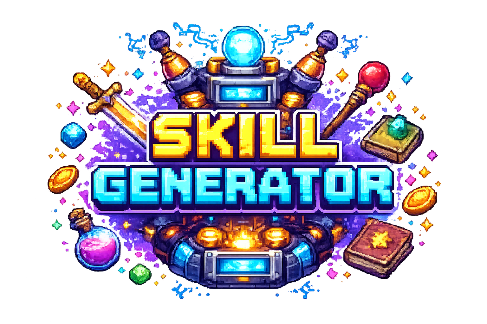

<p align="center">
  
</p>

<h1 align="center">Skill Generator</h1>

<p align="center">
  CLI open source para gerar skills de alta qualidade para Codex e Claude Code usando o OpenAI Agents SDK.
</p>

<p align="center">
  = 3.11" src="https://img.shields.io/badge/python-%3E%3D3.11-3776AB?logo=python&logoColor=white">
  
  
  
  <a href="./LICENSE"></a>
</p>

<p align="center">
  <code>agent-skills</code> | <code>codex</code> | <code>claude-code</code> | <code>openai-agents-sdk</code> | <code>typer-cli</code>
</p>

## O que ele faz

- Gera skills no formato aberto `SKILL.md`
- Otimiza saídas para:
  - Codex: `.agents/skills/<nome>/...`
  - Claude Code: `.claude/skills/<nome>/...`
- Usa um pipeline multiagente:
  - planejamento da skill
  - autoria dos arquivos
  - revisão crítica
  - reparo automático quando necessário
- Mostra spinner com a etapa atual durante a geração para dar feedback no terminal
- Valida nome, frontmatter, estrutura, referências e campos específicos de cada alvo
- Instala a skill gerada por cópia ou symlink

## Instalação

```bash
uv sync
cp .env.example .env
# edite o .env e preencha OPENAI_API_KEY
```

Ou com `pip`:

```bash
pip install -e .
```

O CLI procura `.env` a partir do diretório atual até a raiz do projeto e carrega `OPENAI_API_KEY` automaticamente. Se a variável já existir no shell, o valor do shell tem prioridade.

Tambem suporta `Ollama` via endpoint compativel com OpenAI. Nesse caso, configure `SKILL_GENERATOR_PROVIDER=ollama`, `OLLAMA_BASE_URL` e `OLLAMA_MODEL` no `.env`.

## Uso rápido

Fluxo interativo no terminal:

```bash
uv run skill-generator
```

Ao rodar, a CLI pergunta:

1. qual provedor de modelo usar: `OpenAI` ou `Ollama`
2. para qual ferramenta gerar: `Codex`, `Claude Code` ou `Geral`
3. o que você quer gerar

Depois disso, ela gera a skill automaticamente em `build/skill-generator`.

Modo direto por comando:

```bash
uv run skill-generator generate \
  "Crie uma skill para transformar especificações em planos técnicos curtos e executáveis." \
  --provider openai \
  --target codex \
  --output build/plan-writer
```

Usando Ollama com modelo open source:

```bash
ollama pull qwen2.5:14b-instruct

uv run skill-generator generate \
  "Crie uma skill para gerar interfaces com boas praticas de UI e UX" \
  --provider ollama \
  --model qwen2.5:14b-instruct \
  --base-url http://localhost:11434/v1/
```

Passar contexto adicional:

```bash
uv run skill-generator generate \
  --brief-file docs/skill-brief.md \
  --context-file docs/team-conventions.md \
  --context-file docs/tooling.md \
  --example-request "Analise os logs do deploy e diga o root cause" \
  --target claude
```

Validar skills geradas:

```bash
uv run skill-generator validate build/ci-debugger
```

Instalar no diretório do usuário:

```bash
uv run skill-generator install build/ci-debugger --target codex
uv run skill-generator install build/ci-debugger --target claude --mode symlink
```

Compatibilidade:

- `skill-generator` é o nome principal da CLI
- `skillforge` continua disponível como alias

## `.env`

Exemplo:

```env
SKILL_GENERATOR_PROVIDER=openai
OPENAI_API_KEY=sk-your-openai-api-key-here
```

O arquivo esperado é `.env` na raiz do projeto. Um modelo pronto foi adicionado em `.env.example`.

Exemplo com Ollama:

```env
SKILL_GENERATOR_PROVIDER=ollama
OLLAMA_BASE_URL=http://localhost:11434/v1/
OLLAMA_MODEL=qwen2.5:14b-instruct
OLLAMA_API_KEY=ollama
```

## Arquitetura

`skill-generator generate` executa este fluxo:

1. `planner agent` converte o briefing em uma especificação estruturada
2. `author agent` gera os arquivos da skill
3. `review agent` audita trigger, foco, portabilidade e ergonomia
4. `repair agent` corrige a saída caso o review encontre problemas bloqueantes
5. validadores locais checam a árvore antes de escrever em disco

## Decisões de design

- O formato-base segue o padrão aberto Agent Skills, então a skill continua portátil.
- O alvo `codex` inclui `agents/openai.yaml` quando isso melhora UX, descoberta e política de invocação.
- O alvo `claude` pode incluir campos extras como `disable-model-invocation`, `allowed-tools`, `argument-hint` e `context`.
- O modelo padrão do CLI é `gpt-5.3-codex`, escolhido por ser o modelo de codificação mais capaz listado nas docs da OpenAI no momento da implementação, em 20 de abril de 2026.

## Referências de produto e formato

- Agent Skills specification: https://agentskills.io/specification
- Codex skills docs: https://developers.openai.com/codex/skills
- Codex docs MCP: https://developers.openai.com/learn/docs-mcp
- Claude Code skills docs: https://code.claude.com/docs/en/slash-commands
- Claude Code subagents docs: https://code.claude.com/docs/en/sub-agents
- OpenAI Agents SDK: https://openai.github.io/openai-agents-python/
- OpenAI Sandbox agents guide: https://openai.github.io/openai-agents-python/sandbox/guide/

## Status

Este projeto gera skills e valida a estrutura localmente. A qualidade final ainda depende do briefing e do contexto fornecido ao modelo.
